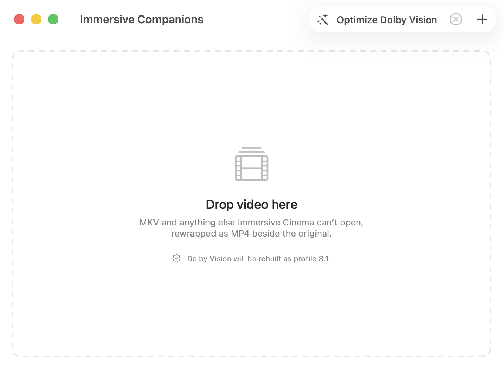
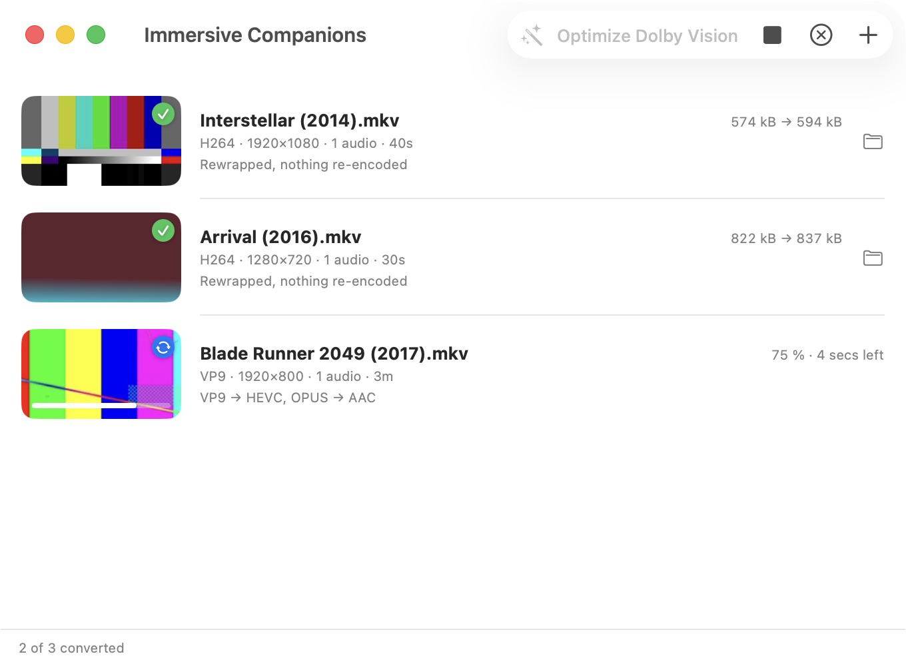

# Immersive Companions


The Mac companion to [Immersive Cinema](https://github.com/Nico8324/Immersive-Cinema). It
rewraps video into MP4 the library can open — keeping Dolby Vision, HDR, chapters, every
audio track and every subtitle MP4 will carry.

<p align="center">
  
</p>

## Contents

- [Why it exists](#why-it-exists)
- [What it does to the file](#what-it-does-to-the-file)
- [Dolby Vision](#dolby-vision)
- [It checks its own work](#it-checks-its-own-work)
- [Requirements](#requirements)
- [Building](#building)
- [Using it](#using-it)
- [Known limits](#known-limits)

## Why it exists

Immersive Cinema is multiplatform — iOS, iPadOS, macOS, tvOS, visionOS — and that shapes
what it can be. It can't spawn a process on an Apple TV, so it can't lean on the
command-line tools that solve certain problems properly. Anything that needs them belongs
out here, on the Mac, where a library gets prepared before it's imported.

The problem that needs them: AVFoundation has no Matroska demuxer. Not "MKV plays badly" —
`AVURLAsset` refuses to open one at all:

```
load(.isPlayable, .duration)  FAILED: Cannot Open
loadTracks                    FAILED: Cannot Open
AVAssetReader                 FAILED: Cannot Open
```

That holds even when the streams inside are H.264 and AAC, which the same framework plays
perfectly out of an MP4, and it holds if you rename the file — AVFoundation reads the bytes,
finds an EBML header rather than ISO BMFF, and stops.

The consequence worth understanding: Immersive Cinema **can't optimize its way out of this**.
Its optimizer is `AVAssetReader` → `AVAssetWriter`, so the step that would fix the container
is the step that can't read it. The fix has to happen before the file reaches the library.

That's this app. It drives the `ffmpeg` already on your Mac, writes an MP4 beside the
original, and leaves the original alone.

## What it does to the file

As little as it can get away with. Immersive Cinema has its own optimizer, which knows
Apple's bit rate ladder and decides properly whether a file is worth re-encoding. Doing that
here as well would spend a generation of quality on a judgement this app isn't the one
making. So:

| Stream | Kept as-is | Re-encoded |
| --- | --- | --- |
| Video | H.264, HEVC | everything else → HEVC (VideoToolbox), at the source's own bit rate |
| Audio | AAC, AC-3, E-AC-3, ALAC, MP3 | everything else → AAC, 256 kbps stereo / 640 kbps surround |
| Subtitles | SRT, ASS, WebVTT → `mov_text` | PGS and VobSub are dropped — MP4 has nowhere to put them |

A typical MKV is H.264 or HEVC with AAC or AC-3, so the usual result is a **stream copy**:
a couple of seconds, byte-for-byte identical picture, no quality lost. The row tells you
which you got — "Rewrapped, nothing re-encoded" or what was converted and why.

Also carried across: **chapters**, HDR colour tags, mastering-display and content-light
metadata, per-track languages, and every audio track so a film keeps its other languages.
Cover-art "video" streams are skipped, so a poster doesn't become the film.

### When it does re-encode

The settings are Immersive Cinema's own `PlaybackTarget`, transcribed — not an
approximation. Deferring the bit rate question to the library works for a stream copy, but a
re-encode here is *final*: the optimizer will judge what it finds, find an HEVC file inside
its tolerance, and quite correctly leave it alone.

- **HEVC** via VideoToolbox, tagged `hvc1`
- **Bit rate** = `min(Apple's rung for the frame, what the source was already spending × a
  codec ratio)`. Rungs from the HLS Authoring Specification, chosen by pixel count rather
  than height, ×1.5 above 33 fps, with the HDR uplift. The ratio is 0.65 from H.264, 0.95
  from VP9, **1.3 from AV1** — AV1 does more with its bits than HEVC can
- **Key frames** every 2 seconds
- **Main 10 / P010 / Rec. 2020** for HDR, **Main / 8-bit / Rec. 709** for SDR, with the
  colour description written into the bitstream — VideoToolbox drops two thirds of it
  otherwise, and an untagged HDR picture is the washed-out grey one
- **Never resized.** The frame that goes in is the frame that comes out

A worked example: a 1.8 Mbps VP9 file re-encodes at 1.66 Mbps, not Apple's 10 Mbps rung for
1080p. Detail a file has already thrown away doesn't come back when you spend more bits on
it — it would just be five times the size and no better.

## Dolby Vision

Apple plays profiles 5 and 8.1. A Blu-ray rip is **profile 7** — base layer, enhancement
layer and an RPU — which decodes on no Apple device. The metadata is right there in the
file, though, and 8.1 is the profile it was always going to become. So if `dovi_tool` and
`MP4Box` are installed, the track is rebuilt rather than flattened:

| Source | What happens |
| --- | --- |
| Profile 7 | converted to 8.1, enhancement layer discarded (~10% smaller) |
| Profile 5 | converted to 8.1 — otherwise it's *unwatchable*, its base being IPT-graded |
| Profile 8 | signalling rewritten so it survives the trip into MP4 |
| No DV | untouched |

Three steps, because no single tool does all of it. ffmpeg demuxes but can't rewrite an
RPU; `dovi_tool` rewrites the RPU but doesn't mux; and ffmpeg's MP4 muxer **cannot write
the `dvvC` box** that marks a track as Dolby Vision — only GPAC will. So the video goes out
to a raw stream, through `dovi_tool`, and back in through `MP4Box`, while audio and
subtitles take the ordinary route and are added at the end.

It's written as `dvp=8.hdr10` — profile 8 with the HDR10 compatibility ID — so a player
that knows Dolby Vision gets Dolby Vision, and one that doesn't still sees correct HDR10.

Verified on a 4K profile 7 Blu-ray rip:

```
video: hevc tag=hvc1 3840x2160 yuv420p10le smpte2084
  Dolby Vision: profile 8.1  EL=0  RPU=1
```

### Optimizing without losing it

Immersive Cinema's optimizer rebuilds the picture through `AVAssetWriter`, and nothing
public puts an RPU back afterwards — so optimizing a Dolby Vision file *there* costs you the
Dolby Vision. That leaves a real choice between a fat file that keeps it and a lean one that
doesn't.

`dovi_tool` can do both halves, so with **Optimize Dolby Vision** switched on the round trip
happens here instead: the RPU comes out of the source, the base layer is re-encoded at the
library's own target, and the RPU goes back in between the slices. Every frame is where it
was — the encode changes neither frame count nor rate — so every RPU lands on the frame it
describes.

```
66.5 Mbps  →  22 Mbps        Dolby Vision: profile 8.1  RPU=1
```

Off by default. Converting is the job; re-encoding costs a generation of quality and real
time, and should be asked for. It applies only to Dolby Vision, because that's the only case
the library can't handle for itself.

## It checks its own work

ffmpeg exiting zero does not mean the file plays. A conversion can finish, produce an MP4
AVFoundation opens, enumerates and reads through `AVAssetReader` — and still get
`isPlayable == false`. That is exactly what happens when an HEVC track is tagged `hev1`
rather than `hvc1`, which is how HEVC arrives out of Matroska. ffmpeg has no opinion on it;
only the framework doing the playing does.

So the framework is asked, before the file is called done: `AVURLAsset` is loaded, the
video track and duration checked, and an `AVAssetReader` constructed — the same thing
Immersive Cinema's optimizer does first. A file that fails is deleted rather than left
looking importable.

It also refuses to start when the disk can't hold the result, rather than filling it and
failing an hour in.

## Requirements

| | |
| --- | --- |
| Build | Xcode 16 or later |
| Required | [ffmpeg](https://ffmpeg.org) |
| Optional | `dovi_tool` and `gpac`, for Dolby Vision |

```bash
brew install ffmpeg          # required
brew install dovi_tool gpac  # for Dolby Vision
```

Nothing is bundled, on purpose. ffmpeg is LGPL, and shipping a copy inside an app carries
obligations — notices, the right to relink — that a personal tool has no business taking on.
Invoking it as a separate process keeps that boundary clean. The app looks in
`/opt/homebrew/bin`, `/usr/local/bin`, `/opt/local/bin` and `/usr/bin`, and says so plainly
if it finds nothing.

Without `dovi_tool` and `MP4Box` the file still converts — it just arrives as its HDR10
base layer, which beats refusing the job.

## Building

Open `ImmersiveCompanions.xcodeproj` and run, or:

```bash
xcodebuild -project ImmersiveCompanions.xcodeproj -scheme ImmersiveCompanions build
```

## Using it

Drop files on the window, use the **+** button, drop them on the Dock icon, or Open With
from Finder. Conversions run one at a time — the encoder is fixed-function hardware, so a
second one alongside the first finishes no sooner and just competes for disk.

Each row reads what the conversion read: codec, frame size, dynamic range or Dolby Vision
profile, how many audio and subtitle tracks, and how long the film runs — so you can see it
picked the picture and not the cover art before it spends an hour on it. While it converts
you get the percentage and roughly how much longer; when it's done, the size before and
after. Right-click a row to show it in Finder, try it again, or take it out of the list.

<p align="center">
  
</p>

The still beside each row is a frame from the file, chosen the way Immersive Cinema chooses
artwork on import: sampled from the opening, skipping anything essentially black, so a fade
in or a distributor card doesn't become the picture. It has to be decoded with `ffmpeg`
rather than `AVAssetImageGenerator` for the same reason the app exists at all — AVFoundation
won't open the file yet. While a file converts, how far through it is runs across the
bottom of its still, which is where the library draws it on a film you're partway through.

Then import the MP4 into Immersive Cinema and let its optimizer decide about bit rate —
unless you converted with **Optimize Dolby Vision**, in which case it's already done, and
the app knows to leave Dolby Vision alone.

## Known limits

- **Atmos in TrueHD can't survive.** MP4 has no mapping for TrueHD, and no free encoder
  produces E-AC-3 with JOC — Dolby's own engine is licensed. You keep the discrete channels
  as AAC, and any AC-3 track is copied untouched for receiver passthrough. **Atmos already
  carried as E-AC-3 is copied, and survives intact.**
- **PGS and VobSub subtitles are dropped.** MP4 has nowhere to put them. Losing *forced*
  subtitles makes foreign-language scenes unwatchable, so check before relying on it.
- **Variable frame rate** isn't handled on the Dolby Vision route: a raw stream carries no
  timing, so GPAC is given one rate. Films are constant rate; camera footage may not be.
- **HDR stills are converted, not tone mapped.** A frame from a PQ or HLG file is labelled
  with the colour space it was graded in and redrawn into sRGB, which puts the midtones and
  shadows where they belong but has no highlight roll-off, so specular detail above the SDR
  white point clips. Proper tone mapping needs ffmpeg's `zscale`, and Homebrew's bottle is
  built without libzimg. It affects the thumbnail in the list, never the file.
- **Untested paths.** Profile 7 is verified thoroughly on real 4K Blu-ray content. Profiles
  5 and 8 are written from spec and have not been run against real files. The re-encode
  branch for non-HEVC sources *has* now been run end to end — a VP9 and Opus file arrived as
  HEVC tagged `hvc1`, key frames exactly every 2 seconds, Rec. 709 fully tagged, at 1.65
  Mbps against a source asking 1.8 — but only on synthetic footage, and only in SDR.

## Licence

Proprietary. See [LICENSE](LICENSE).
